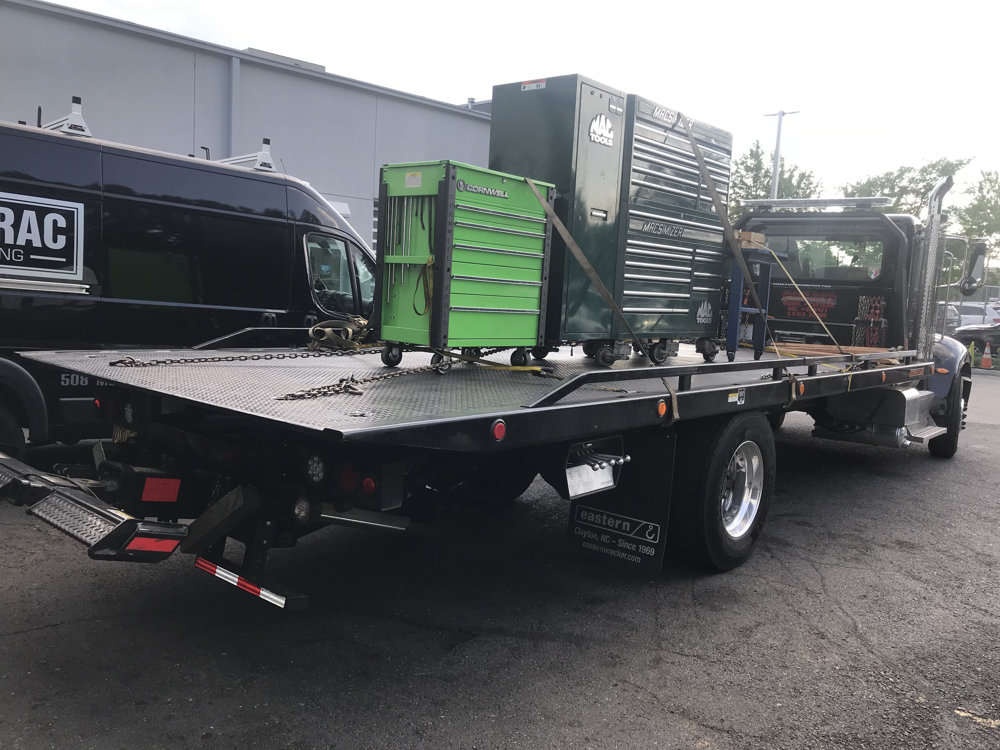
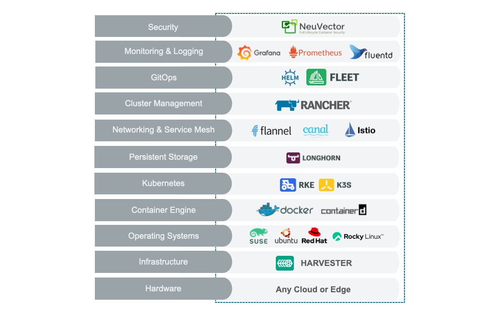
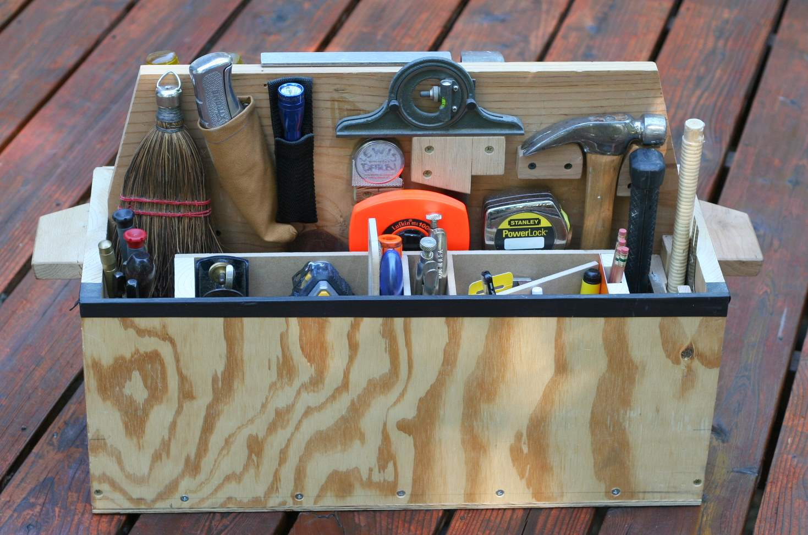

# Driving Freedom of Choice with a Flexible Kubernetes Infrastructure

How making a few simple choices can drive freedom and flexibility.

---

> **Table of Contents:**
>- [Introduction](#introduction)
>- [Current Thinking](#current-thinking)
>- [New Strategy](#new-strategy)
>   - [Right Sizing](#right-sizing)
>   - [Improve Scaling](#improve-scaling)
>   - [Reduce Operational Costs](#reduce-operational-costs)
>   - [Better Focus on Problems](#better-focus-on-problems)
>- [Perfect Kubernetes Stack](#perfect-kubernetes-stack)
>- [Conclusion](#conclusion)
>- [Disclaimer](#disclaimer)

---

## Introduction

Throughout my career there has always been the struggle around complexity of systems. This topic comes up more and more. The reason is that there has never been more layers to our infrastructure. These layers add complexity while simultaneously adding options. There has never been more choices for how and where to develop, build, and deploy applications. Just look at the job titles that are used today, Site Reliability Engineer (SRE), DevSecOps Engineer, PLatform Engineer, and Cloud Engineer. It is really tough not to see every new technology in terms of [Gartner's Hype Cycle](https://www.gartner.com/en/documents/3887767). Trough of Disillusionment ring a bell?

Imagine a "hype cycle" for every layer of technology. Imagine the reality check when facing the Trough of Disillusionment. As technologists, we should always be asking ourselves "How can we flatten the curves?". How can we make the technology easier, faster and more reliable? I had a Vice President of Sales once tell me in 2017 "Andy, you have to dumb this shit down for me". That statement ring true every day for me. How can we flatten the curves for everyone? Let's focus on the Kubernetes and the "Cloud".

## Current Thinking

The current trend is for companies, and governments, to leave the data-center and head to the "cloud". Remember that the "cloud" is just someone elses computer. This trend has been very costly in the long run for many reasons. First and foremost are the technologies needed to be adopted to validate/simplify the move. Infrastructure as code is one of the technologies, or core concepts, for a highly effective transition to the "cloud". The problem comes in when trying to choose the right tool for the right job. Picking the wrong tool can have dramatic implications further on down the road. Case in point, The Amazon Prime Video team published an [article](https://www.primevideotech.com/video-streaming/scaling-up-the-prime-video-audio-video-monitoring-service-and-reducing-costs-by-90) about how they saved money and improved performance by migrating away from Lamda. Lamda is a Serverless Function framework. This article highlights a trend, that is showing up more and more, of moving back toward traditional, monolithic, software/system designs. In response to the article [Adrain Cockcroft](https://adrianco.medium.com/so-many-bad-takes-what-is-there-to-learn-from-the-prime-video-microservices-to-monolith-story-4bd0970423d4) has a great quote.

> *So maybe the answer to the question of whether to build with microservices or a monolith is neither, you should be calling an existing service rather than rolling your own.*

I love the idea and simplicity of looking before building. Adding costs into the equation is another major headache for companies/governments. A few years ago Dropbox started a [Reverse Migration](https://www.datacenterknowledge.com/manage/dropbox-s-reverse-migration-cloud-own-data-centers-five-years) from the cloud to back on premise. Cost was one of the major factors that drove this decision. The cloud providers tend to charge for every packet, byte and connection for every resource. Just updating a virtual machine will add additional, unforeseen, costs. There is even an industry to help with the costs. There are dozens, if not hundreds, of [Cloud Cost Optimization Companies](https://www.cloudzero.com/blog/cloud-cost-management-tools) that can help reduce cloud costs. An entire industry was built around the complexity of cost using the cloud providers! All of this makes you start to think if the "cloud" is a bad idea. One fun way of looking at the level of effort is how mechanics move their toolbox between shops. They have to rent a tow truck to moved all their tools.

The key take away is to be a little more methodical about what and when things are moved. And to also make sure you have the tooling, aka truck, in place to help facilitate the move itself. What about the next move? Because newer technologies tend to be more complicated and nuanced. We need a newer approach to the tooling we use. What if we had a thin abstraction layer that would dramatically improve the portability and speed at which we can move? Again focusing on Kubernetes we do have a tool called [Rancher](https://www.rancher.com/products/rancher).

## New Strategy

Let's call the new strategy "right toolbox". The basic is idea follows what [Adrain Cockcroft](https://adrianco.medium.com/so-many-bad-takes-what-is-there-to-learn-from-the-prime-video-microservices-to-monolith-story-4bd0970423d4) wrote. It is around having a large enough toolbox to be able to pick the right tool for the job. While not trying to build the biggest toolbox around. Again focusing in on the Kubernetes ecosystem. Applying the "right toolbox" strategy really means looking at a few tools in each of the different product categories. Obviously we are big fans of the Rancher Stack.

One of the key takeaways is that you can pick and choose what tools you want to use at all the different layers. Meaning, you can use any operating system. Any infrastructure. Any storage layer. Why is this important? This creates Freedom of Choice and prevents vendor lock-in. One area to look at is Multi-Cluster Managers. [Rancher](https://www.rancher.com/products/rancher) is the best for providing that thin layer of abstraction. And provides a single interface for wherever your compute happens to be.

### Right Sizing

One of the biggest trends that we are seeing lately is the capability of edge computing. This trend is following the idea of data locality. This is where it is more efficient to compute where the data is generated or captured. This is really coupled with the increasing power of modern CPUs, memory, storage and even GPUs. Having a flexible stack means you can use the same applications that are destined for the data-center on the edge. And providing the same User Interface (UI)/User Experience (UX). For reference we published an article about [Deploying at the Edge with Kubernetes](https://intelligencecommunitynews.com/ic-insiders-tactical-edge-reference-architecture/) highlighting the capability of the modern edge. For sizing clusters, using the "right toolbox" strategy means not relying on the cloud provider specific tooling for scaling and deploying. It also means starting with the applications to determine the size of the compute envelope.

### Improve Scaling

From a scaling point of view. We can better manage the compute envelope with a multi-cluster manager. [Rancher](https://www.rancher.com/products/rancher), in short, is a Secure Multi-Cluster Manager that can manage cluster lifecycles on any cloud provider. This enables significantly easier scaling within a single provider, or even to multiple providers. Rancher can not only be used to scale environments, but also create them. We can layer IaC techniques to manage entire clusters. We can use the same tooling to also manage the application that are deployed "auto-magically". This is called GitOPS. Rancher has a builtin tool called [Fleet](https://fleet.rancher.io/) for GitOps. Rancher also has the advantage of managing multiple cloud providers.  Imagine managing clusters in the cloud and on premise from the same tool and interface?

### Reduce Operational Costs

Speaking of cost, there are a few ways where the "right toolbox" can help. For starters, being able to eliminate costly tools that are not needed. Secondary, is it eliminates the "tech debt" and cognitive load on the engineers having to maintain the tools. Third, is the abstraction away from the cloud vender specific tooling. Think about the cost of vendor lock when using their tools at every level of the stack. Today there are several tools that are single cloud vendor specific. If you want to switch cloud providers your teams will have to spend valuable time converting the business logic to the new framework/tooling. Fourth, is eliminating the "nickle and diming" that some cloud vendors do when it comes to ingress and egress of data.

### Better Focus on Problems

The new strategy is allowing all the DevSecOp/SRE/Platform Engineering/Developers to focus on the more important tasks. We are starting to see new trends in even abstracting away Kubernetes. [Acorn Labs](https://www.acorn.io/microservices-are-dead-long-live-the-monolith/) has a great article about how microservices are dead. [Acorn](https://acorn.io) is a tool that abstracts away application deployment on Kubernetes. It simplifies code that is required to define an application and its resource requirements. One slick advantage is being able to abstract away enough for transition to the next "Kubernetes".

## Perfect Kubernetes Stack

What is the perfect Kubernetes Stack today? We have a nice [Reference Architecture for the Rancher Stack](https://github.com/clemenko/rancher-ref-arch) that will help with some of the specifics. For me, the perfect stack is one that will be malleable to as many situations as possible. One that can live nicely in a cloud or at the tactical edge. A stack that I can swap or add a GPU or disconnect from the internet and know it will perform reliably. We think using as many of the Rancher components as possible is the best idea. Some of the underlying principles for Rancher is security and interoperability. Rancher and RKE2 ( Kubernetes ) both have DISA Security Technical Implementation Guides (STIGs). We have several articles that go in depth on [NSA Hardening Guide](https://intelligencecommunitynews.com/ic-insiders-creating-a-secure-kubernetes-deployment-five-ways-the-new-nsa-kubernetes-hardening-guide-can-help/) and the [STIG Guidance](https://intelligencecommunitynews.com/ic-insiders-have-you-stigd-your-kubernetes-yet/). With all the security in mind, my "perfect stack" looks like:

- Hardware - [Dell R6615 AMD Epyc Server](https://www.dell.com/en-us/shop/servers-storage-and-networking/poweredge-r6615-rack-server/spd/poweredge-r6615/pe_r6615_16729_vi_vp) - Several 1Us for HA
- HyperConverged - [Harvester](https://www.rancher.com/products/harvester) - VMs and containers
- VM OS - [Rocky Linux 9](rockylinux.org) - SELINUX support
- Kubernetes [RKE2](https://www.rancher.com/products/rke) - Security Focused Kubernetes
- Storage - [Longhorn](https://www.rancher.com/products/longhorn) - Uses storage already present
- Multi-Cluster Management - [Rancher](https://www.rancher.com/products/rancher) - Manages Application and Cluster Lifecycles
- Security - [Neuvector](https://neuvector.com/) - Proactive Security & Observability
- GitOPS - [Rancher](https://www.rancher.com/products/rancher) - GitOPS is built in with Fleet

I would deploy everything with Infrastructure as Code (IaC) principles. This will give us the ability to deploy to any cloud, anywhere, and at any time.

## Conclusion

Hopefully this helps in changing the perception that there is only "ONE" tool. Adopting the "right toolbox" strategy is a fantastic way to reduce costs, improve flexibility, and dramatically increase velocity. It also can provide a thin abstraction layer to empower your teams. Any "cloud", any Operating System, any hardware, and any size.

Does [Rancher](https://www.rancher.com/products/rancher) and it's stack help flatten the curve? We think it does. We also think [Rancher](https://www.rancher.com/products/rancher) provides the thin abstraction that facilitates massive Freedom of Choice.

Please feel free to reach out to learn more about [Rancher](https://www.rancher.com/products/rancher) and the other products.

## Disclaimer

> "This publication was prepared or accomplished by the author in a personal capacity. All opinions expressed by the author of this publication are solely their current opinions and do not reflect the opinions of Rancher Federal, Inc., respective parent companies, or affiliates with which the author is affiliated. The author's opinions are based upon information they consider reliable, but neither Rancher Federal, Inc., nor its affiliates, nor the companies with which the author is affiliated, warrant its completeness or accuracy, and it should not be relied upon as such."
